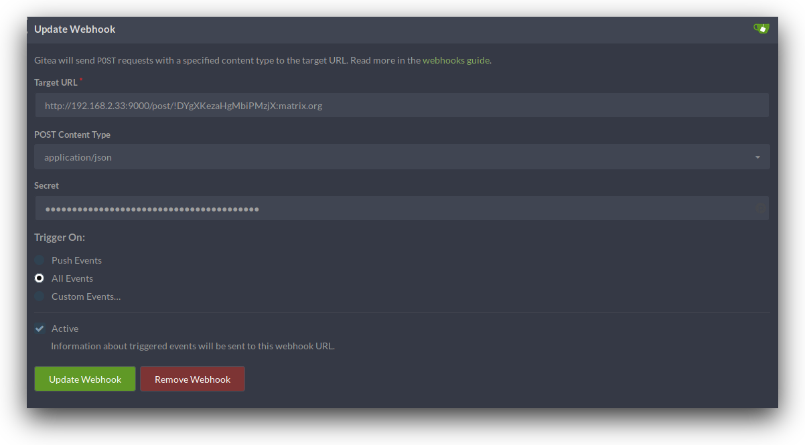

[](https://travis-ci.org/binaryplease/gitea-matrix-bot)
[](https://godoc.org/github.com/binaryplease/gitea-matrix-bot)
[](https://goreportcard.com/report/github.com/binaryplease/gitea-matrix-bot)
[](https://codecov.io/gh/binaryplease/gitea-matrix-bot)


# gitea-matrix-bot
A bot to listen for [gitea](https://gitea.io) webhooks and post to a [matrix](https://matrix.org) channel

This bot was build using my [bot framework](https://github.com/binaryplease/matrix-bot/). If you stumble upon bugs on any of them please let me know!


#### Status
This project is still in beta! You may encouter bugs, be sure to
**report them** so they can be fixed!

Join the support channel for help and discussion:
[#gitea-matrix-bot:matrix.org](https://matrix.to/#/#gitea-matrix-bot:matrix.org)

# Usage
If you have already an instance of this bot running somewhere or someone is already hosting it publicly (lucky you!) and just want to add it to your room, this is how to create a webhook for your repository:

1. Invite the bot to the room you want it to post to
2. Find your room's id. This is **not** the name or adress! It starts with an exclamation mark and has a format like this`!DYgXKezaHgMbiPMzjX:matrix.org`
3. Use the room ID to request a token from the bot `!gitea secret !DYgXKezaHgMbiPMzjX:matrix.org`. You can issue this command in a different room or private chat if you want to keep it secret if the room you're adding the bot to has members that are not supposed to view the token
4. The bot will reply to you with instructions on how to set up the gitea webhook. Set up a webhook of type `gitea` with the url provided and use the token as secret. Select the specific types of events you want to be notified on or select "All Events"

It will probably look like this:


# Installation
To host the bot yourself, you will need to have a valid account on a matrix server and  create a configuration file.

Copy config.ini.example to config.ini or create a file called config.ini with the
following options:

```ini
[http]
# The path the listener will expect the post data
http_uri = "/post"
# The port the listener will listen on
http_port = "9000"


[matrix]
# The matrix server to connect to
matrix_host = "http://matrix.org"
# The matrix room to post to
matrix_room = "#my-awesome-room:matrix.org"
# User credentions of the bot for posting to the room
matrix_pass = "supersecretpass"
matrix_user = "my-awesome-bot"


[bot]
# Path of the database to be used
db_path = "./tokens.db"
```
If the database does not exist yet (your running the bot for the first time) you will have to use the `--initdb` flag to create it. This will create a sqlite3 database at the configured location with the expected table. 

The following flags are avaitible for this bot:

```
Flags:
      --help                 Show context-sensitive help (also try --help-long and --help-man).
  -v, --verbose              Verbose mode, displays additional information.
  -c, --config="config.ini"  Configuration file to use
      --initdb               Initialize the database. If it exists, it will be overwritten!
      --sync=1               Matrix synchronizing interval
      --version              Show application version.
```

If everything went fine your gitea bot is now up and running! Make sure the configured port is open and the address reachable from the gitea server!

# Contributing

If you would like to help you are **very welcome**, please submit
pull-requests!

Also, I'm looking for testers and bugs in the code. If you hit a problem, please
be sure to report it so it can be fixed. You can **open an issue** ticket or **contact
me** in the room liked above.
